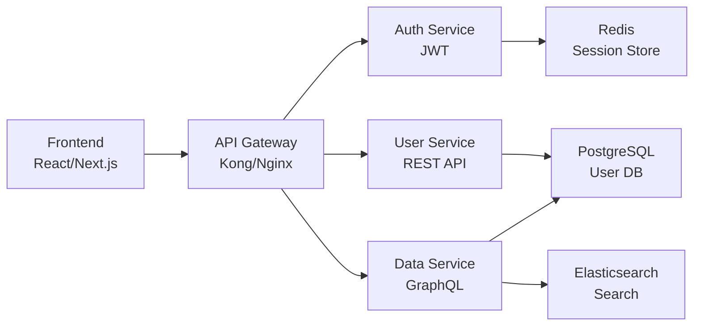
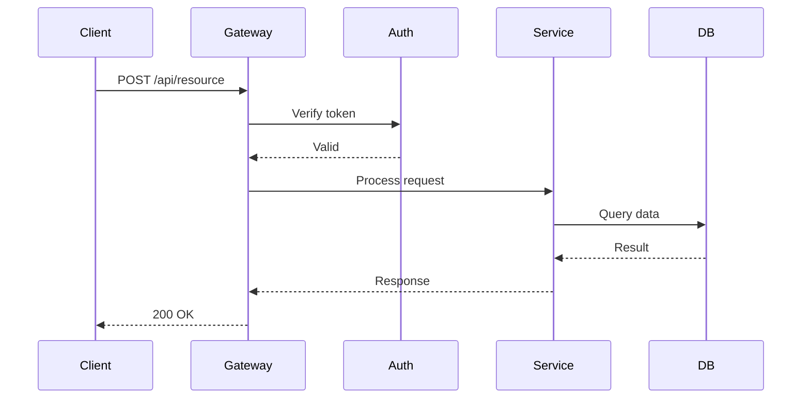
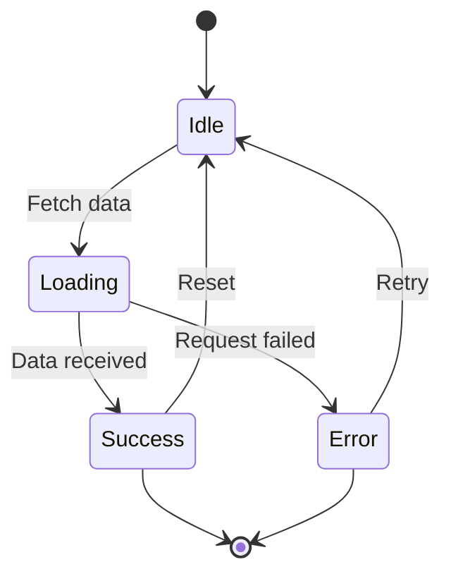
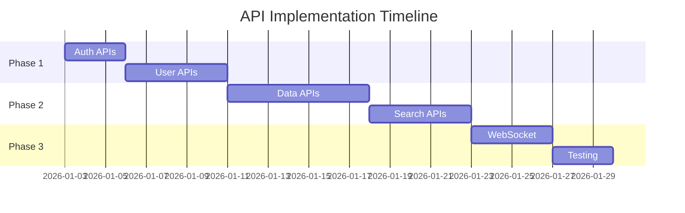

# Figma MCP Integration for @SA

## Overview

Figma MCP tools enable @SA to:
- Understand UI requirements from Figma designs
- Extract component structure for API design
- Create architecture diagrams in FigJam
- Map design components to backend services
- Generate data models from design patterns

## Key Figma MCP Tools for @SA

### 1. Get Metadata
**Tool:** `mcp_figma_get_metadata`
**Purpose:** Understand design structure to inform API design

**Use Case:** Before designing APIs, understand what UI components need

**Usage:**
```javascript
// Get page structure to understand UI needs
mcp_figma_get_metadata({
  fileKey: "pqrs",
  nodeId: "0:1", // Page ID
  clientLanguages: "typescript",
  clientFrameworks: "react,nextjs"
})
```

**Output:** XML structure showing:
- Component hierarchy
- Layer types and names
- Positions and sizes
- Node IDs for detailed inspection

### 2. Get Design Context
**Tool:** `mcp_figma_get_design_context`
**Purpose:** Understand component props and data requirements

**Use Case:** Design APIs that match UI component needs

**Usage:**
```javascript
// Analyze component to understand data needs
mcp_figma_get_design_context({
  fileKey: "pqrs",
  nodeId: "user-profile-card",
  clientLanguages: "typescript",
  clientFrameworks: "react,nextjs"
})
```

**Analysis:**
- What data does this component display?
- What actions does it trigger?
- What API endpoints are needed?

### 3. Generate Diagram
**Tool:** `mcp_figma_generate_diagram`
**Purpose:** Create architecture diagrams in FigJam

**Supported Diagrams:**
- **Flowchart:** System architecture, data flows
- **Sequence Diagram:** API interactions, request/response flows
- **State Diagram:** Application state management
- **Gantt Chart:** Implementation timeline

**Usage:**
```javascript
// Create architecture diagram
mcp_figma_generate_diagram({
  name: "Microservices Architecture",
  mermaidSyntax: `
    flowchart LR
      A["API Gateway"] --> B["Auth Service"]
      A --> C["User Service"]
      A --> D["Payment Service"]
      B --> E["Database"]
      C --> E
      D --> F["Payment Gateway"]
  `,
  userIntent: "Document microservices architecture"
})

// Create API sequence diagram
mcp_figma_generate_diagram({
  name: "Authentication Flow",
  mermaidSyntax: `
    sequenceDiagram
      participant Client
      participant API
      participant Auth
      participant DB
      
      Client->>API: POST /login
      API->>Auth: Validate credentials
      Auth->>DB: Query user
      DB-->>Auth: User data
      Auth-->>API: JWT token
      API-->>Client: 200 OK + token
  `,
  userIntent: "Document authentication API flow"
})
```

### 4. Get Variable Definitions
**Tool:** `mcp_figma_get_variable_defs`
**Purpose:** Extract design tokens to inform API response structure

**Use Case:** Design API responses that match design system

**Usage:**
```javascript
// Get design tokens
mcp_figma_get_variable_defs({
  fileKey: "pqrs",
  nodeId: "design-tokens"
})
```

**Application:**
```json
// API response includes design tokens
{
  "user": {
    "name": "John Doe",
    "status": "active",
    "statusColor": "#00FF00" // From design tokens
  }
}
```

### 5. Code Connect Map
**Tool:** `mcp_figma_get_code_connect_map`
**Purpose:** Understand which components exist and their data needs

**Usage:**
```javascript
// Get component mappings
mcp_figma_get_code_connect_map({
  fileKey: "pqrs",
  nodeId: "1:2"
})
```

**Analysis:**
- Which components are implemented?
- What data structures do they expect?
- What APIs are already defined?

## @SA Workflow with Figma MCP

### Phase 1: Requirements Analysis
```bash
# 1. Get design structure
mcp_figma_get_metadata({
  fileKey: "project-file",
  nodeId: "0:1", # Main page
  clientLanguages: "typescript",
  clientFrameworks: "react,nextjs"
})

# 2. Analyze key components
mcp_figma_get_design_context({
  fileKey: "project-file",
  nodeId: "dashboard-component",
  clientLanguages: "typescript",
  clientFrameworks: "react,nextjs"
})

# 3. Extract design tokens
mcp_figma_get_variable_defs({
  fileKey: "project-file",
  nodeId: "tokens-page"
})
```

### Phase 2: API Design
```bash
# Based on component analysis, design APIs

# Example: Dashboard component needs:
# - GET /api/user/profile
# - GET /api/user/stats
# - GET /api/user/recent-activity

# Document in Backend-Design-Spec
```

### Phase 3: Architecture Documentation
```bash
# 1. Create system architecture diagram
mcp_figma_generate_diagram({
  name: "System Architecture",
  mermaidSyntax: `
    flowchart LR
      A["Frontend"] --> B["API Gateway"]
      B --> C["Auth Service"]
      B --> D["User Service"]
      B --> E["Data Service"]
      C --> F["Redis Cache"]
      D --> G["PostgreSQL"]
      E --> G
  `
})

# 2. Create API flow diagrams
mcp_figma_generate_diagram({
  name: "User Registration Flow",
  mermaidSyntax: `
    sequenceDiagram
      participant UI
      participant API
      participant Auth
      participant DB
      participant Email
      
      UI->>API: POST /register
      API->>Auth: Validate input
      Auth->>DB: Create user
      DB-->>Auth: User created
      Auth->>Email: Send verification
      Auth-->>API: Success
      API-->>UI: 201 Created
  `
})

# 3. Create state diagrams
mcp_figma_generate_diagram({
  name: "Order State Machine",
  mermaidSyntax: `
    stateDiagram-v2
      [*] --> Pending
      Pending --> Processing: Payment confirmed
      Processing --> Shipped: Items packed
      Shipped --> Delivered: Received
      Delivered --> [*]
      
      Pending --> Cancelled: User cancels
      Processing --> Cancelled: Payment fails
      Cancelled --> [*]
  `
})
```

### Phase 4: Data Model Design
```bash
# Based on component analysis and design tokens

# Example: User Profile component needs:
interface UserProfile {
  id: string;
  name: string;
  email: string;
  avatar: string;
  status: 'active' | 'inactive';
  statusColor: string; // From design tokens
  createdAt: Date;
  stats: {
    posts: number;
    followers: number;
    following: number;
  };
}

# Document in Backend-Design-Spec
```

## Best Practices

### 1. Analyze Before Designing
```javascript
// Step 1: Get design overview
const structure = await mcp_figma_get_metadata({
  fileKey: "project",
  nodeId: "0:1"
})

// Step 2: Identify key components
// Look for: forms, lists, cards, dashboards

// Step 3: Analyze each component
for (const component of keyComponents) {
  const context = await mcp_figma_get_design_context({
    fileKey: "project",
    nodeId: component.id
  })
  
  // Extract data requirements
  // Design corresponding APIs
}
```

### 2. Design APIs to Match UI Needs
```javascript
// Component shows: User card with avatar, name, bio, stats
// Design API response to match:

GET /api/users/:id
Response:
{
  "id": "123",
  "avatar": "https://...",
  "name": "John Doe",
  "bio": "Software engineer",
  "stats": {
    "posts": 42,
    "followers": 150,
    "following": 89
  }
}
```

### 3. Document Architecture Visually
```javascript
// Create comprehensive architecture diagrams

// System overview
mcp_figma_generate_diagram({
  name: "High-Level Architecture",
  mermaidSyntax: "flowchart LR..."
})

// API interactions
mcp_figma_generate_diagram({
  name: "API Sequence Diagrams",
  mermaidSyntax: "sequenceDiagram..."
})

// State management
mcp_figma_generate_diagram({
  name: "State Machines",
  mermaidSyntax: "stateDiagram-v2..."
})

// Include diagram URLs in Backend-Design-Spec
```

### 4. Coordinate with @UIUX
```markdown
### Design-API Alignment

**Component:** User Dashboard
**Figma Node:** 1:2
**Data Requirements:**
- User profile: GET /api/user/profile
- Activity feed: GET /api/user/activity?limit=10
- Statistics: GET /api/user/stats

**Design Tokens Used:**
- Status colors: From Figma variables
- Spacing: 8px grid system
- Typography: Inter font family

### Questions for @UIUX:
- Does dashboard need real-time updates? (WebSocket vs polling)
- What's the pagination strategy for activity feed?
- Are stats cached or real-time?
```

## Integration with @SA Workflow

### In Backend-Design-Spec
```markdown
## Design Analysis

**Figma Design Reference:** [Link to Figma]
- File Key: `abc123`
- Analyzed Components: Dashboard (1:2), Profile (3:4), Settings (5:6)

### Component-to-API Mapping

| Component | Node ID | Data Needs | API Endpoints |
|-----------|---------|------------|---------------|
| Dashboard | 1:2 | User stats, activity | GET /api/user/stats, GET /api/user/activity |
| Profile | 3:4 | User details, posts | GET /api/user/:id, GET /api/user/:id/posts |
| Settings | 5:6 | User preferences | GET /api/user/settings, PUT /api/user/settings |

### Architecture Diagrams

**System Architecture:**
[FigJam Diagram URL]

**API Flow Diagrams:**
- Authentication: [FigJam URL]
- Data Fetching: [FigJam URL]
- Real-time Updates: [FigJam URL]

**State Machines:**
- User Session: [FigJam URL]
- Data Sync: [FigJam URL]

## API Specifications

### GET /api/user/stats
**Purpose:** Provide data for dashboard stats component (Node: 1:2)

**Response:**
```json
{
  "posts": 42,
  "followers": 150,
  "following": 89,
  "engagement": 0.85
}
```

**Design Alignment:**
- Matches dashboard component data structure
- Includes design token for engagement color
```

### Handoff to @DEV
```markdown
### Implementation Guidance

**Figma Integration:**
- Component code available via `mcp_figma_get_design_context`
- Design tokens extracted and documented
- Architecture diagrams in FigJam for reference

**API Implementation Priority:**
1. Authentication endpoints (see sequence diagram)
2. User profile endpoints (dashboard dependency)
3. Activity feed endpoints (pagination required)

**Architecture Diagrams:**
- System overview: [FigJam URL]
- API flows: [FigJam URL]
- State machines: [FigJam URL]

### Next Step:
- @DEV - Implement APIs per specification
- @UIUX - Confirm API responses match component needs
- @DEVOPS - Review architecture for deployment strategy
```

## Common Patterns

### Pattern 1: Component-Driven API Design
```javascript
// 1. Analyze UI component
const component = await mcp_figma_get_design_context({
  fileKey: "project",
  nodeId: "product-card"
})

// 2. Extract data requirements
// Component shows: image, title, price, rating, stock status

// 3. Design API
GET /api/products/:id
{
  "id": "123",
  "image": "https://...",
  "title": "Product Name",
  "price": 29.99,
  "rating": 4.5,
  "inStock": true
}

// 4. Document in spec
```

### Pattern 2: Architecture Documentation
```javascript
// Create comprehensive architecture docs

// 1. High-level architecture
const archUrl = await mcp_figma_generate_diagram({
  name: "System Architecture",
  mermaidSyntax: `
    flowchart LR
      A["Client"] --> B["CDN"]
      A --> C["API Gateway"]
      C --> D["Microservices"]
      D --> E["Databases"]
      D --> F["Cache"]
  `
})

// 2. API sequence diagrams
const apiUrl = await mcp_figma_generate_diagram({
  name: "API Interactions",
  mermaidSyntax: "sequenceDiagram..."
})

// 3. State machines
const stateUrl = await mcp_figma_generate_diagram({
  name: "Application States",
  mermaidSyntax: "stateDiagram-v2..."
})

// 4. Include all URLs in Backend-Design-Spec
```

### Pattern 3: Design Token Integration
```javascript
// 1. Extract design tokens
const tokens = await mcp_figma_get_variable_defs({
  fileKey: "design-system",
  nodeId: "tokens"
})

// 2. Design API to include tokens
GET /api/config/theme
{
  "colors": {
    "primary": "#007AFF",
    "success": "#00FF00",
    "error": "#FF0000"
  },
  "spacing": {
    "base": 8,
    "small": 4,
    "large": 16
  }
}

// 3. Frontend uses tokens from API
// Ensures design-code consistency
```

### Pattern 4: Real-time Requirements Analysis
```javascript
// 1. Analyze component for real-time needs
const dashboard = await mcp_figma_get_design_context({
  fileKey: "project",
  nodeId: "dashboard"
})

// 2. Identify real-time elements
// - Live notifications
// - Activity feed updates
// - Status changes

// 3. Design WebSocket API
WebSocket /ws/updates
Events:
- notification.new
- activity.update
- status.change

// 4. Document in sequence diagram
mcp_figma_generate_diagram({
  name: "WebSocket Flow",
  mermaidSyntax: `
    sequenceDiagram
      participant Client
      participant WS
      participant Server
      
      Client->>WS: Connect
      WS->>Server: Authenticate
      Server-->>WS: Connected
      Server->>WS: notification.new
      WS->>Client: Push notification
  `
})
```

## Mermaid Diagram Examples

### System Architecture


### API Sequence Diagram


### State Machine


### Gantt Chart (Implementation Timeline)


## Troubleshooting

### Issue: Can't Understand Component Data Needs
**Solution:**
1. Use `get_metadata` to see component structure
2. Use `get_design_context` to see generated code
3. Analyze props and data structures
4. Ask @UIUX for clarification

### Issue: Design Tokens Don't Match API
**Solution:**
1. Extract tokens with `get_variable_defs`
2. Include tokens in API responses
3. Document token usage in spec
4. Coordinate with @UIUX on token structure

### Issue: Complex Architecture Hard to Document
**Solution:**
1. Break into multiple diagrams
2. Use flowchart for high-level
3. Use sequence diagrams for interactions
4. Use state diagrams for state management
5. Link all diagrams in spec

## Metrics to Track

- **Components Analyzed:** Number of Figma components reviewed
- **APIs Designed:** Number of endpoints created
- **Architecture Diagrams:** Number of diagrams created
- **Design-API Alignment:** % of APIs matching UI needs
- **Time Saved:** Hours saved by analyzing designs first

## Related Documentation

- `.agent/roles/role-sa.md` - Full @SA role documentation
- `.agent/knowledge-base/features/figma-mcp-uiux-guide.md` - @UIUX Figma integration
- Architecture Decision Records (ADRs) in KB

#figma #mcp #sa #architecture #api-design #compound-learning
