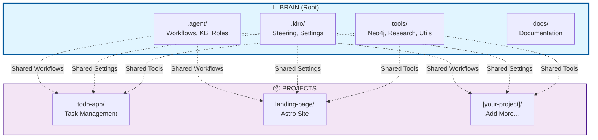

# Agentic SDLC

> Simulating a complete Software Development Lifecycle (SDLC) with specialized AI Agents.

Transform your IDE into a full SDLC team with 12 specialized AI roles, automated workflows, and knowledge management.

## 🧠 Monorepo Architecture

This is a **monorepo** where the root contains the **Brain** (AI Agent System) and all sub-projects share and use it:



```
agentic-sdlc/                    # 🧠 BRAIN (Root)
├── .agent/                      # ✅ Shared AI workflows, KB, roles
├── .kiro/                       # ✅ Shared Kiro IDE settings  
├── tools/                       # ✅ Shared tools (Neo4j, research, etc.)
├── docs/                        # Brain documentation
│
└── projects/                    # 📦 SUB-PROJECTS (use Brain)
    ├── todo-app/               # Todo application
    ├── landing-page/           # Landing page site
    └── [add-yours]/            # Your projects here
```

**Key Concepts:**
- **Brain (Root):** Contains all AI infrastructure, tools, and knowledge
- **Projects:** Individual applications that use Brain's capabilities
- **Shared Everything:** Workflows, KB, tools are shared across all projects
- **Compound Learning:** Solutions from one project benefit all others

**See:** 
- [`projects/README.md`](projects/README.md) - How to use Brain in projects
- [`docs/MONOREPO-ARCHITECTURE.md`](docs/MONOREPO-ARCHITECTURE.md) - Complete architecture guide

## ✨ Features

- 🤖 **12 AI Roles** - PM, SA, UI/UX, QA, Security, Dev, DevOps, Tester, Reporter, Stakeholder, PO, Orchestrator
- ⚡ **Slash Commands** - `/pm`, `/dev`, `/auto` in your IDE
- 🔄 **Auto Workflow** - Full automation or manual control
- 🧠 **Knowledge Base** - Learn from past challenges
- 🎨 **IDE Integration** - Cursor, Copilot, Windsurf, Cline, Aider
- 📚 **16 Templates** - Plans, designs, reports, documentation
- 🌐 **All Platforms** - Web, Mobile, Desktop, CLI, API, Embedded

## 🚀 Quick Start

```bash
# Install
npm install -g agentic-sdlc

# Create project
agentic-sdlc create my-project
cd my-project

# Setup IDE
agentic-sdlc ide cursor

# Start building (in IDE)
/pm Build a todo app with authentication
```

**That's it!** See [Quick Start](docs/guides/QUICK-START.md) for details.

## 📖 Documentation

### Quick Links
- **[Complete Documentation Index](docs/PROJECT-DOCUMENTATION-INDEX.md)** - Full documentation catalog
- **[Documentation Outline](docs/OUTLINE.md)** - Central hub for all guides
- **[Quick Start Guide](docs/guides/QUICK-START.md)** - Get started in 5 minutes
- **[CLI Examples](docs/guides/CLI-EXAMPLES.md)** - Complete usage examples

### Core Documentation
- **[Project Structure](PROJECT-STRUCTURE.md)** - Detailed project organization
- **[File Naming Standards](FILE-NAMING-STANDARDS.md)** - Naming conventions
- **[Standardization Summary](STANDARDIZATION-SUMMARY.md)** - Recent updates

### Setup & Configuration
- **[Research Agent Setup](docs/setup/RESEARCH-AGENT-SETUP.md)** - Research system setup
- **[GitHub Management](docs/setup/GITHUB-MANAGEMENT.md)** - GitHub integration
- **[MCP Setup](docs/guides/MCP-SETUP.md)** - MCP configuration

### Tools & Utilities
- **[Research Agent](tools/research/README.md)** - Automated research system with Neo4j integration
- **[Neo4j Tools](tools/neo4j/README.md)** - Knowledge graph database for skills and relationships
- **[GitHub Tools](tools/github/)** - GitHub integration and synchronization
- **[Setup Scripts](tools/setup/)** - Installation and configuration scripts
- **[Role Communication System](docs/guides/ROLE-COMMUNICATION-SYSTEM.md)** - Internal chat system for agent roles

## 🎯 Use Cases

### Solo Developer
```bash
/auto Create a SaaS platform for project management
# Automated workflow, complete in days
```

### Team Project
```bash
agentic-sdlc ide all
agentic-sdlc init-kb
# Shared workflow, consistent quality
```

### Existing Project
```bash
agentic-sdlc install
agentic-sdlc ide cursor
# Add SDLC to any project
```

## 🔧 CLI Commands

```bash
agentic-sdlc install              # Install in current directory
agentic-sdlc create <name>        # Create new project
agentic-sdlc ide <cursor|all>     # Setup IDE integration
agentic-sdlc init-kb              # Initialize knowledge base
agentic-sdlc list                 # List templates & roles
agentic-sdlc --help               # Show help
```

## 🧠 Neo4j Knowledge Graph Integration

The project includes powerful Neo4j integration for managing skills and knowledge relationships:

### Quick Start with Neo4j

```bash
# 1. Sync all knowledge base entries to Neo4j
python tools/neo4j/sync_skills_to_neo4j.py

# 2. Query your skills
python tools/neo4j/query_skills_neo4j.py --all-skills

# 3. Find related skills
python tools/neo4j/query_skills_neo4j.py --skill "Graph Databases"

# 4. Get learning path
python tools/neo4j/query_skills_neo4j.py --learning-path "Architecture"
```

### What Neo4j Provides

- **Skills Graph** - Visual representation of all skills and relationships
- **Technology Mapping** - Connect skills to technologies used
- **Learning Paths** - Discover skill progression routes
- **Knowledge Discovery** - Find related knowledge automatically
- **Team Expertise** - Track who knows what across the team

### Research Agent Integration

The Research Agent automatically queries Neo4j when researching tasks:

```bash
# Research with Neo4j knowledge graph
python tools/research/research_agent.py --task "authentication" --type feature

# Output includes:
# - File-based knowledge base results
# - Neo4j graph relationships
# - Related technologies and skills
# - Confidence level based on available knowledge
```

### Configuration

Add Neo4j credentials to `.env`:

```bash
NEO4J_URI=neo4j+s://xxxxx.databases.neo4j.io
NEO4J_USERNAME=neo4j
NEO4J_PASSWORD=your-password
NEO4J_DATABASE=neo4j
```

**See [Neo4j Tools Documentation](tools/neo4j/README.md) for complete guide.**

## 🎨 IDE Slash Commands

After setup, use these in your IDE:

```bash
/pm              # Project Manager
/auto            # Full automation
/sa              # System Analyst
/uiux            # UI/UX Designer
/dev             # Developer
/devops          # DevOps Engineer
/tester          # Tester
/kb-search       # Search knowledge base
```

## 📊 Project Structure

```
agentic-sdlc/                           # 🧠 BRAIN (Root)
│
├── 📁 .agent/                          # ✅ SHARED - AI Agent System
│   ├── workflows/                      # 18 workflow definitions
│   ├── knowledge-base/                 # Compound learning KB
│   ├── roles/                          # AI role definitions
│   ├── templates/                      # 16 document templates
│   ├── rules/                          # Global rules
│   └── ide-integration/                # IDE configurations
│
├── 📁 .kiro/                           # ✅ SHARED - Kiro IDE Settings
│   ├── steering/                       # 17 steering files
│   │   ├── global-rules.md
│   │   ├── compound-learning.md
│   │   ├── workflow-enhancements.md
│   │   └── ...
│   └── settings/                       # IDE settings
│       └── mcp.json
│
├── 📁 tools/                           # ✅ SHARED - Utilities
│   ├── neo4j/                          # Knowledge graph
│   │   ├── sync_skills_to_neo4j.py
│   │   ├── query_skills_neo4j.py
│   │   ├── graph_brain.py
│   │   └── README.md
│   ├── research/                       # Research agent
│   │   ├── research_agent.py
│   │   ├── research_mcp.py
│   │   └── README.md
│   ├── kb/                             # KB management
│   ├── github/                         # GitHub integration
│   ├── setup/                          # Setup scripts
│   └── README.md
│
├── 📁 docs/                            # Documentation
│   ├── PROJECT-DOCUMENTATION-INDEX.md  # Complete index
│   ├── MONOREPO-ARCHITECTURE.md        # Architecture guide
│   ├── guides/                         # User guides
│   ├── architecture/                   # Architecture docs
│   ├── setup/                          # Setup guides
│   └── sprints/                        # Sprint artifacts
│
├── 📁 projects/                        # 📦 SUB-PROJECTS
│   ├── README.md                       # Monorepo guide
│   ├── todo-app/                       # Todo application
│   │   ├── frontend/
│   │   ├── backend/
│   │   └── README.md
│   └── landing-page/                   # Landing page site
│       ├── src/
│       ├── public/
│       └── README.md
│
├── 📁 bin/                             # Legacy CLI (deprecated)
├── 📁 trash/                           # Archived files
│
├── 📄 README.md                        # This file
├── 📄 PROJECT-STRUCTURE.md             # Detailed structure
├── 📄 package.json                     # Root package.json
└── 📄 .gitignore
```

**See:** 
- [PROJECT-DOCUMENTATION-INDEX.md](docs/PROJECT-DOCUMENTATION-INDEX.md) - Complete file listing
- [MONOREPO-ARCHITECTURE.md](docs/MONOREPO-ARCHITECTURE.md) - Architecture details

## 🌟 Examples

See [CLI-EXAMPLES.md](docs/guides/CLI-EXAMPLES.md) for:
- Real-world workflows
- Team collaboration
- Automation scripts
- Troubleshooting
- Pro tips

## 📦 What's Included

- **12 Roles:** Complete SDLC team
- **16 Templates:** All documentation needs
- **Knowledge Base:** Learn and improve
- **IDE Integration:** 5+ IDEs supported
- **Automation:** Full-auto or manual modes
- **Multi-platform:** Web, mobile, desktop, CLI, API

## 🤝 Contributing

Contributions welcome! See issues for ideas.

## 📄 License

MIT

## 🔗 Links

- **Repository:** https://github.com/truongnat/agentic-sdlc
- **Issues:** https://github.com/truongnat/agentic-sdlc/issues
- **NPM:** https://www.npmjs.com/package/agentic-sdlc
