# BRAIN Architecture - Master Orchestrator

## Overview

The **BRAIN** is the root-level master controller that manages all workflow execution with strict adherence to the SDLC diagram. It acts as a state machine that enforces workflow rules, validates transitions, and orchestrates all roles.

## Architecture Diagram


## State Machine Flow

```mermaid
stateDiagram-v2
    [*] --> IDLE
    IDLE --> PLANNING: User provides requirements
    
    PLANNING --> PLAN_APPROVAL: PM completes plan
    PLAN_APPROVAL --> DESIGNING: User approves
    PLAN_APPROVAL --> PLANNING: User rejects
    
    DESIGNING --> DESIGN_REVIEW: All designs complete
    DESIGN_REVIEW --> DEVELOPMENT: QA+SECA approve
    DESIGN_REVIEW --> DESIGNING: Issues found
    
    DEVELOPMENT --> TESTING: Dev+DevOps complete
    TESTING --> BUG_FIXING: Critical/High bugs found
    TESTING --> DEPLOYMENT: No critical bugs
    
    BUG_FIXING --> TESTING: Bugs fixed
    
    DEPLOYMENT --> REPORTING: Production deployed
    REPORTING --> FINAL_REVIEW: Report complete
    FINAL_REVIEW --> FINAL_APPROVAL: Stakeholder reviews
    
    FINAL_APPROVAL --> COMPLETE: User approves
    FINAL_APPROVAL --> PLANNING: User rejects
    
    COMPLETE --> [*]
    
    note right of PLAN_APPROVAL
        🚪 Approval Gate 1
        User decision required
    end note
    
    note right of DESIGN_REVIEW
        Parallel: QA + SECA
        Both must approve
    end note
    
    note right of FINAL_APPROVAL
        🚪 Approval Gate 3
        User decision required
    end note
```



## Component Architecture

### 1. State Machine
**Responsibility:** Manage workflow states and transitions

```typescript
interface StateMachine {
  currentState: WorkflowState;
  previousState: WorkflowState;
  stateHistory: StateTransition[];
  
  canTransition(from: State, to: State): boolean;
  transition(to: State): Result;
  rollback(to: State): Result;
}
```

### 2. Validation Engine
**Responsibility:** Validate prerequisites and artifacts

```typescript
interface ValidationEngine {
  validatePhaseCompletion(state: State): ValidationResult;
  validateArtifacts(state: State): ArtifactCheck[];
  validateRoleCompletion(state: State): RoleStatus[];
  validateApprovalGate(gate: Gate): ApprovalStatus;
}
```

### 3. Rule Enforcer
**Responsibility:** Enforce workflow rules

```typescript
interface RuleEnforcer {
  enforceNoPhaseSkip(transition: Transition): boolean;
  enforceApprovalGate(gate: Gate): boolean;
  enforceScopeControl(feature: Feature): boolean;
  enforceParallelCompletion(roles: Role[]): boolean;
  enforceBugPriority(bugs: Bug[]): boolean;
}
```

### 4. Role Orchestrator
**Responsibility:** Manage role activation and coordination

```typescript
interface RoleOrchestrator {
  activateRole(role: Role, context: Context): void;
  activateParallel(roles: Role[]): void;
  waitForCompletion(roles: Role[]): Promise<void>;
  notifyNextRole(role: Role, message: string): void;
}
```

### 5. Monitor & Metrics
**Responsibility:** Track progress and performance

```typescript
interface Monitor {
  trackPhaseTime(state: State): Duration;
  trackApprovalGates(): GateMetrics;
  trackIterations(): IterationCount;
  trackEfficiency(): EfficiencyMetrics;
  generateReport(): MetricsReport;
}
```

### 6. Communication Layer
**Responsibility:** Persist role-to-role context and "thoughts" via Chat System.

```typescript
interface ChatSystem {
  channel: string; // e.g., "general"
  thread: string;  // e.g., "Feature-X"
  
  sendMessage(role: Role, content: string): void;
  getHistory(limit: number): Message[];
}
```
```

## Data Flow


## Command Interface

### Status Command
```
@BRAIN /status
```
Shows current state, progress, and next steps.

### Validation Command
```
@BRAIN /validate
```
Validates current phase completion and readiness for transition.

### Auto-Execute Command
```
@BRAIN /auto-execute
```
Runs full workflow with automatic role orchestration.

### Force Transition (Emergency)
```
@BRAIN /force-transition [REASON]
```
Bypasses validation (logged, requires user confirmation).

### Rollback Command
```
@BRAIN /rollback [STATE]
```
Rolls back to previous state (requires user confirmation).

## Integration Points

### With Existing Roles
- BRAIN activates roles at appropriate phases
- Roles report completion to BRAIN
- BRAIN validates role outputs before transition

### With Enhanced Workflows
- `/cycle` - Managed as mini-workflow within current state
- `/explore` - Pauses main workflow for investigation
- `/emergency` - Overrides normal flow with logging
- `/compound` - Triggered automatically for learnings

### With Knowledge Base
- BRAIN logs all state transitions
- Documents approval decisions
- Records validation failures
- Compounds workflow patterns

## Error Handling

### Validation Failure
```
1. Block transition
2. Log failure reason
3. Notify responsible role
4. Wait for fix
5. Re-validate
```

### Role Failure
```
1. Keep current state
2. Log error details
3. Notify role with error
4. Provide recovery guidance
5. Wait for completion
```

### Approval Rejection
```
1. Rollback to PLANNING
2. Create new plan version
3. Document rejection reason
4. Notify PM
5. Restart workflow
```

## State Persistence

State stored in: `docs/sprints/sprint-N/.brain-state.json`

```json
{
  "sprint": "sprint-1",
  "currentState": "DESIGNING",
  "previousState": "PLAN_APPROVAL",
  "stateHistory": [...],
  "approvalGates": {...},
  "artifacts": {...},
  "roleStatus": {...},
  "metrics": {...}
}
```

## Benefits

1. **Strict Enforcement** - No phase skipping or rule violations
2. **Complete Traceability** - Full history of all transitions
3. **Error Recovery** - Safe rollback and retry mechanisms
4. **Parallel Optimization** - Automatic parallel role execution
5. **Quality Gates** - Mandatory validation at each phase
6. **Metrics Tracking** - Complete workflow analytics
7. **Knowledge Compound** - Automatic learning capture

## Usage Example

```
User: @BRAIN - Build a todo app with React

🧠 BRAIN Initialized
━━━━━━━━━━━━━━━━━━━━━━━━━━━━━━━━━━━━━━━━━━━━━━
State: IDLE → PLANNING
Action: Activating @PM

@PM - Create project plan for todo app with React
Expected: Project-Plan-v1.md in docs/sprints/sprint-1/plans/
━━━━━━━━━━━━━━━━━━━━━━━━━━━━━━━━━━━━━━━━━━━━━━

[PM creates plan]

🧠 BRAIN Status Update
━━━━━━━━━━━━━━━━━━━━━━━━━━━━━━━━━━━━━━━━━━━━━━
State: PLANNING → PLAN_APPROVAL
Validation: ✅ Project-Plan-v1.md exists

🚪 Approval Gate 1: Project Plan
Please review: docs/sprints/sprint-1/plans/Project-Plan-v1.md

Approve to proceed to DESIGNING phase.
━━━━━━━━━━━━━━━━━━━━━━━━━━━━━━━━━━━━━━━━━━━━━━

User: Approved

🧠 BRAIN Status Update
━━━━━━━━━━━━━━━━━━━━━━━━━━━━━━━━━━━━━━━━━━━━━━
State: PLAN_APPROVAL → DESIGNING
Action: Activating parallel roles

@SA - Create architecture spec
@UIUX - Create UI/UX spec  
@PO - Create product backlog

Waiting for all roles to complete...
━━━━━━━━━━━━━━━━━━━━━━━━━━━━━━━━━━━━━━━━━━━━━━

[Workflow continues through all phases...]
```

## Future Enhancements

1. **AI-Powered Predictions** - Predict phase durations
2. **Auto-Recovery** - Automatic error recovery strategies
3. **Workflow Templates** - Pre-configured workflows for common projects
4. **Real-time Dashboard** - Visual workflow progress
5. **Integration APIs** - External tool integration
6. **Custom Rules** - User-defined validation rules

---

**Version:** 1.0.0
**Created:** 2026-01-02
**Status:** Active

