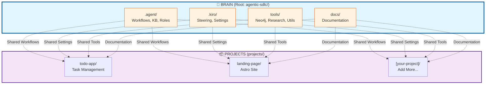

# Monorepo Architecture - Brain System

## Overview

This project uses a **monorepo architecture** where the root contains the **Brain** (AI Agent System) and all sub-projects share and use it.

## Architecture Diagram



## Directory Structure

```
agentic-sdlc/                           # 🧠 BRAIN (Root)
│
├── 📁 .agent/                          # ✅ SHARED - AI Agent System
│   ├── workflows/                      # Workflow implementations
│   │   ├── documentation-updates.md
│   │   ├── pm.md
│   │   ├── dev.md
│   │   └── ...
│   ├── knowledge-base/                 # Compound learning KB
│   │   ├── INDEX.md
│   │   ├── bugs/
│   │   ├── features/
│   │   ├── architecture/
│   │   └── ...
│   ├── roles/                          # AI role definitions
│   ├── templates/                      # Document templates
│   └── rules/                          # Global rules
│
├── 📁 .kiro/                           # ✅ SHARED - Kiro IDE Settings
│   ├── steering/                       # Steering files
│   │   ├── global-rules.md
│   │   ├── compound-learning.md
│   │   ├── workflow-enhancements.md
│   │   └── ...
│   └── settings/                       # IDE settings
│       └── mcp.json
│
├── 📁 tools/                           # ✅ SHARED - Utilities
│   ├── neo4j/                          # Knowledge graph
│   │   ├── sync_skills_to_neo4j.py
│   │   ├── query_skills_neo4j.py
│   │   └── README.md
│   ├── research/                       # Research agent
│   │   ├── research_agent.py
│   │   └── README.md
│   ├── kb/                             # KB management
│   ├── github/                         # GitHub integration
│   ├── setup/                          # Setup scripts
│   └── README.md
│
├── 📁 docs/                            # Documentation
│   ├── PROJECT-DOCUMENTATION-INDEX.md
│   ├── ARCHITECTURE-OVERVIEW.md
│   ├── guides/
│   ├── setup/
│   └── ...
│
├── 📁 projects/                        # 📦 SUB-PROJECTS
│   ├── README.md                       # Monorepo guide
│   │
│   ├── 📁 todo-app/                    # Project 1
│   │   ├── frontend/
│   │   ├── backend/
│   │   ├── package.json
│   │   └── README.md
│   │
│   ├── 📁 landing-page/                # Project 2
│   │   ├── src/
│   │   ├── public/
│   │   ├── astro.config.mjs
│   │   └── README.md
│   │
│   └── 📁 [your-project]/              # Add more...
│       └── ...
│
├── 📁 bin/                             # Legacy CLI (deprecated)
├── 📁 trash/                           # Archived files
│
├── README.md                           # Main README
├── package.json                        # Root package.json
└── .gitignore
```

## How It Works

### 🧠 Brain Components

#### 1. `.agent/` - AI Agent System
**Purpose:** Core AI workflows, knowledge base, and role definitions

**What's Shared:**
- ✅ Workflows: `/cycle`, `/explore`, `/compound`, `/emergency`
- ✅ Roles: @PM, @DEV, @SA, @UIUX, @QA, @SECA, etc.
- ✅ Knowledge Base: Shared learnings across all projects
- ✅ Templates: Document templates for all projects

**Usage from Projects:**
```bash
cd projects/todo-app
@DEV /cycle - Add new feature
@PM - Create project plan
```

#### 2. `.kiro/` - Kiro IDE Settings
**Purpose:** IDE configuration and steering files

**What's Shared:**
- ✅ Steering files: Global rules, patterns, workflows
- ✅ MCP settings: Shared MCP server configurations
- ✅ IDE settings: Consistent IDE behavior

**Usage from Projects:**
```bash
# Steering files automatically loaded
# MCP tools available in all projects
```

#### 3. `tools/` - Shared Utilities
**Purpose:** Common tools and scripts

**What's Shared:**
- ✅ Neo4j: Knowledge graph database
- ✅ Research Agent: Automated research system
- ✅ KB Management: Knowledge base utilities
- ✅ GitHub Integration: Sync and automation
- ✅ Setup Scripts: Installation and configuration

**Usage from Projects:**
```bash
cd projects/landing-page
python ../../tools/neo4j/sync_skills_to_neo4j.py
python ../../tools/research/research_agent.py --task "..."
```

#### 4. `docs/` - Documentation
**Purpose:** Centralized documentation

**What's Shared:**
- ✅ Architecture guides
- ✅ Setup instructions
- ✅ Best practices
- ✅ API documentation

### 📦 Project Structure

Each project in `projects/` can have:

```
projects/your-project/
├── src/                        # Your source code
├── tests/                      # Your tests
├── .kiro/                      # Project-specific settings
│   └── specs/                  # Project-specific specs
│       └── feature-name/
│           ├── requirements.md
│           ├── design.md
│           └── tasks.md
├── package.json                # Project dependencies
└── README.md                   # Project documentation
```

**Note:** Projects do NOT duplicate `.agent/`, `.kiro/steering/`, or `tools/`

## Workflow Examples

### Example 1: Start New Feature
```bash
# Navigate to project
cd projects/todo-app

# Use Brain workflows
@DEV /cycle - Add user authentication

# Brain automatically:
# 1. Uses workflows from /.agent/workflows/
# 2. Searches KB in /.agent/knowledge-base/
# 3. Uses tools from /tools/
# 4. Stores learnings in shared KB
```

### Example 2: Research for Project
```bash
cd projects/landing-page

# Use research agent
@SA /explore - Best practices for landing page SEO

# Research agent:
# 1. Uses /tools/research/research_agent.py
# 2. Stores findings in /.agent/knowledge-base/
# 3. Available to all other projects
```

### Example 3: Sync Knowledge
```bash
# From any project or root
sync

# Syncs to Neo4j:
# - All KB entries from /.agent/knowledge-base/
# - Available to all projects via graph queries
```

### Example 4: Emergency Fix
```bash
cd projects/todo-app

# Emergency workflow
@DEV /emergency - Database connection failing

# Emergency workflow:
# 1. Uses /.agent/workflows/emergency.md
# 2. Documents fix in /.agent/knowledge-base/
# 3. Other projects learn from this fix
```

## Benefits

### 🧠 Shared Intelligence
- **One Knowledge Base:** All projects contribute and benefit
- **Compound Learning:** Solutions compound over time
- **Cross-Project Patterns:** Learn once, apply everywhere

### 🔧 Shared Tools
- **No Duplication:** One set of tools for all projects
- **Consistent Workflows:** Same AI workflows everywhere
- **Centralized Maintenance:** Update once, affects all

### 📚 Shared Documentation
- **Common Standards:** Unified documentation style
- **Cross-References:** Easy linking between projects
- **Single Source of Truth:** Documentation in one place

### ⚡ Faster Development
- **Reuse Solutions:** Search KB before implementing
- **Automated Workflows:** Ready-to-use AI workflows
- **Shared Research:** Research once, use everywhere

## Adding New Projects

### Method 1: Create New
```bash
cd projects
mkdir my-new-project
cd my-new-project

# Initialize project
npm init -y

# Start using Brain immediately
@PM - Build a new e-commerce platform
```

### Method 2: Move Existing
```bash
# From root
mv /path/to/existing-project projects/existing-project

# Brain automatically available
cd projects/existing-project
@DEV /cycle - Refactor authentication
```

### Method 3: Clone Template
```bash
cd projects
cp -r todo-app my-new-project
cd my-new-project

# Customize and use Brain
@DEV - Implement new features
```

## Best Practices

### ✅ DO

1. **Use Brain from Projects**
   ```bash
   cd projects/your-project
   @DEV /cycle - Add feature
   ```

2. **Contribute to Shared KB**
   ```bash
   # After solving complex problems
   @DEV /compound - Document the solution
   ```

3. **Use Relative Paths for Tools**
   ```bash
   python ../../tools/neo4j/sync_skills_to_neo4j.py
   ```

4. **Keep Projects in `projects/`**
   ```
   projects/
   ├── project-1/
   ├── project-2/
   └── project-3/
   ```

5. **Sync After Major Changes**
   ```bash
   sync  # Sync to Neo4j KB
   ```

### ❌ DON'T

1. **Don't Copy Brain Files**
   ```bash
   # ❌ WRONG
   cp -r .agent/ projects/my-project/.agent/
   
   # ✅ RIGHT
   # Just use Brain from root
   ```

2. **Don't Create Duplicate Tools**
   ```bash
   # ❌ WRONG
   projects/my-project/tools/neo4j/
   
   # ✅ RIGHT
   # Use /tools/ from root
   ```

3. **Don't Store Project-Specific KB in Root**
   ```bash
   # ❌ WRONG
   .agent/knowledge-base/my-project-specific/
   
   # ✅ RIGHT
   projects/my-project/.kiro/specs/
   ```

4. **Don't Modify Brain Without Coordination**
   ```bash
   # ⚠️ CAREFUL - Affects all projects
   vim .agent/workflows/dev.md
   ```

## Git Workflow

### Project-Specific Changes
```bash
cd projects/your-project
git add .
git commit -m "feat(your-project): add new feature"
git push
```

### Brain Changes (Affects All)
```bash
# From root
git add .agent/ .kiro/ tools/
git commit -m "feat(brain): add new workflow"
git push
```

### Monorepo Commit
```bash
# From root
git add .
git commit -m "feat: update multiple projects and brain"
git push
```

## Troubleshooting

### Brain Not Found
```bash
# Verify you're in monorepo
ls ../../.agent/  # Should show Brain files

# Check current location
pwd  # Should be in projects/your-project/
```

### Tools Not Accessible
```bash
# Use relative paths
python ../../tools/neo4j/sync_skills_to_neo4j.py

# Or add to PATH (advanced)
export PATH="$PATH:$(pwd)/../../tools"
```

### Workflows Not Working
```bash
# Ensure Kiro IDE is configured
ls ../../.kiro/steering/  # Should show steering files

# Check MCP settings
cat ../../.kiro/settings/mcp.json
```

### KB Not Syncing
```bash
# Sync from root
cd ../..
sync

# Or use full path
python tools/neo4j/sync_skills_to_neo4j.py
```

## Migration Guide

### Moving Existing Project to Monorepo

1. **Backup Project**
   ```bash
   cp -r /path/to/project /path/to/project.backup
   ```

2. **Move to Projects**
   ```bash
   mv /path/to/project projects/project-name
   ```

3. **Update Paths in Project**
   ```bash
   cd projects/project-name
   # Update any absolute paths to relative paths
   ```

4. **Test Brain Access**
   ```bash
   @DEV - Test workflow
   sync  # Test KB sync
   ```

5. **Update Documentation**
   ```bash
   # Update project README.md
   # Add reference to Brain
   ```

## Related Documentation

- **[Projects README](../projects/README.md)** - Detailed project guide
- **[Brain Overview](../.agent/README.md)** - AI Agent System
- **[Tools Documentation](../tools/README.md)** - Shared tools
- **[Kiro Steering](../.kiro/steering/README.md)** - Steering files
- **[Main README](../README.md)** - Project overview

---

**Remember:** Brain is at the root. All projects share and benefit from it. 🧠✨

#monorepo #architecture #brain #shared-intelligence #compound-learning
